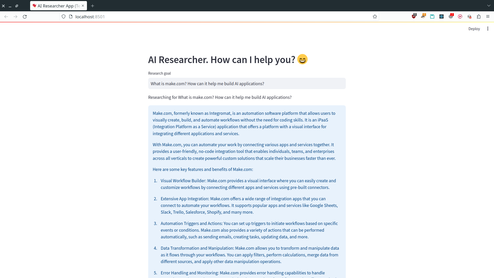

# openai-agent
LLM Agents to research content from the internet and write, run and test
applications.

## Research Agent
The _research agent_ is an advanced application of the OpenAI API to research,
collect and summarize information scraped from the internet based on the user
query. It's available as a FastAPI application and a demo endpoint can be found
at: https://ai-research-agent-c3fh.onrender.com

Streamlit Test Demo (as an advanced search AI):

